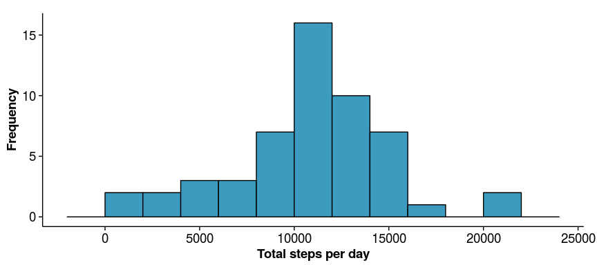
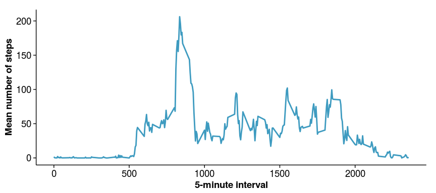
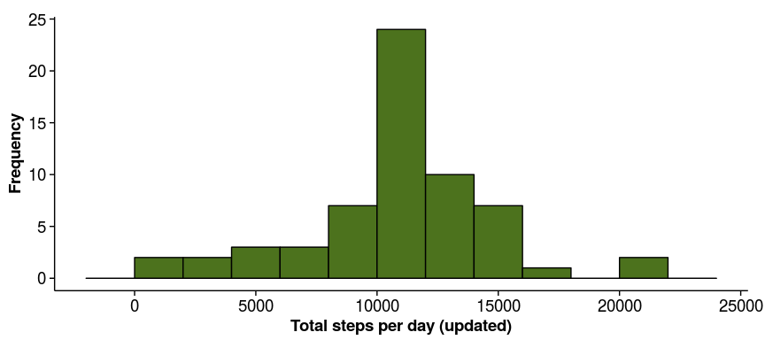
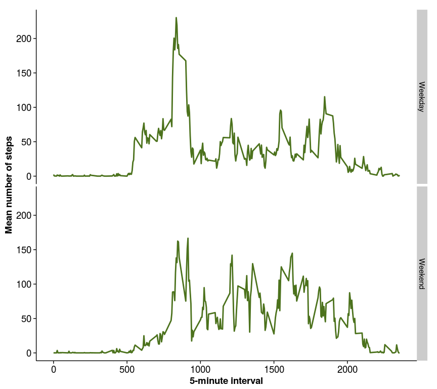

# Reproducible Research: Peer Assessment 1

## Loading and preprocessing the data
First, we load the dataset with global options and transform the data into a suitable format:

```r
library(knitr)
opts_chunk$set(message = FALSE, fig.width = 9, fig.height = 4)
unzip("activity.zip")
Data <- read.csv(file = "activity.csv")
library(lubridate)
Data$date <- ymd(Data$date)
```

## Q1 -- What is mean total number of steps taken per day?
For this part of the assignment, we ignore the missing values in the dataset. First, we calculate the total number of steps per day using the [dplyr](https://github.com/hadley/dplyr) package.

```r
library(dplyr)
steps_per_day <- Data %>%
  group_by(date) %>%
  summarize(total_steps = sum(steps))
```

We then plot the total number of steps per day using a histogram and the [ggplot2](https://github.com/hadley/ggplot2) package along with the [cowplot](https://github.com/wilkelab/cowplot) package:

```r
library(ggplot2)
library(cowplot)
ggplot(steps_per_day, aes(x = total_steps)) +
  geom_histogram(binwidth = 2000, fill = "#3E9BC0", color = "black") +
  xlab("Total steps per day") + ylab("Frequency")
```

 

Finally, we estimate the `mean` and `median` for the total steps taken per day:

```r
steps_per_day %>% 
  filter(!is.na(total_steps)) %>%
  summarize(Mean = mean(total_steps), Median = median(total_steps))
```

```
## Source: local data frame [1 x 2]
## 
##       Mean Median
## 1 10766.19  10765
```

***

## Q2 -- What is the average daily activity pattern?
Herein we show a time-series plot of the 5-minute interval (x-axis) and the average number of steps taken, averaged across all days (y-axis). For this, first we create a data.frame containing the average number of steps per 5-minute interval:

```r
interval_all_days <- Data %>%
  group_by(interval) %>%
  summarize(mean_steps = mean(steps, na.rm = TRUE))
```

We then plot the 5-minute interval in the x-axis and the mean number of steps taken per interval in the y-axis:

```r
ggplot(interval_all_days, aes(x = interval, y = mean_steps)) +
  geom_line(color = "#3E9BC0", size = 1) +
  xlab ("5-minute interval") + ylab("Mean number of steps")
```

 

Finally, the table below shows the 5-minute interval with the maximum mean number of steps:

```r
interval_all_days %>%
  filter(mean_steps == max(mean_steps))
```

```
## Source: local data frame [1 x 2]
## 
##   interval mean_steps
## 1      835   206.1698
```

***

## Q3 -- Imputing missing values
First, we calculate and report the total number of missing values in the dataset.


```r
Data %>% filter(is.na(steps)) %>% summarize(NAs = n())
```

```
##    NAs
## 1 2304
```

As a strategy for filling in all the `NAs` we will use the following approach: if in a row a value for a particular interval is missing we will use the mean value of steps for that particular interval averaged across all days. These mean values of steps were already calculated (see Q2) and they are included in the `interval_all_days` data.frame. We will create a new dataset `Data_NoNAs` similar to the original dataset but with the missing data filled in. In this new dataset, the `steps_nonas` variable will contain the data with the missing values replaced by the mean values, rounded to the closest integer.


```r
Data_NoNAs <- Data %>%
  cbind(mean_steps = interval_all_days$mean_steps) %>%
  mutate(steps_nonas = ifelse(is.na(steps), round(mean_steps), steps))
```

We make a histogram of total number of updated steps taken each day, following the same approach we used for Q1.


```r
steps_per_day_updated <- Data_NoNAs %>%
  group_by(date) %>%
  summarize(total_steps = sum(steps_nonas))
ggplot(steps_per_day_updated, aes(x = total_steps)) +
  geom_histogram(binwidth = 2000, fill = "#4C721D", color = "black") +
  xlab("Total steps per day (updated)") + ylab("Frequency")
```

 

Finally, we estimate the `mean` and `median` for the total steps (updated) taken per day:

```r
steps_per_day_updated %>%
  summarize(Mean = mean(total_steps), Median = median(total_steps))
```

```
## Source: local data frame [1 x 2]
## 
##       Mean Median
## 1 10765.64  10762
```

A `t.test` and a `wilcox.test` show that these values do not significantly differ from the estimates from the first part of the assignment.

```r
t.test(steps_per_day$total_steps, steps_per_day_updated$total_steps)
```

```
## 
## 	Welch Two Sample t-test
## 
## data:  steps_per_day$total_steps and steps_per_day_updated$total_steps
## t = 0.00070752, df = 107.14, p-value = 0.9994
## alternative hypothesis: true difference in means is not equal to 0
## 95 percent confidence interval:
##  -1538.594  1539.693
## sample estimates:
## mean of x mean of y 
##  10766.19  10765.64
```

```r
wilcox.test(steps_per_day$total_steps, steps_per_day_updated$total_steps)
```

```
## 
## 	Wilcoxon rank sum test with continuity correction
## 
## data:  steps_per_day$total_steps and steps_per_day_updated$total_steps
## W = 1620.5, p-value = 0.9841
## alternative hypothesis: true location shift is not equal to 0
```
Thus, the impact of imputing missing data on the estimates of the total daily number of steps is practically null.

***

## 4) Are there differences in activity patterns between weekdays and weekends?
We will use the `Data_NoNAs` dataset with the filled-in missing values for this part. First, we will create a new factor variable `week_day` in the dataset with two levels ("Weekday" and "Weekend") indicating whether a given date corresponds to a weekday or a weekend.


```r
Data_NoNAs <- Data_NoNAs %>%
  mutate(
    week_day = wday(date),
    week_day = ifelse(week_day == 1 | week_day == 7, c("Weekend"), c("Weekday"))
  )
```

We will then build a panel containing a time-series plot of the 5-minute interval (x-axis) and the average number of steps taken across either weekdays or weekends (y-axis).


```r
Data_Week <- Data_NoNAs %>%
  group_by(interval, week_day) %>%
  summarize(mean_steps = mean(steps_nonas))
ggplot(Data_Week, aes(x = interval, y = mean_steps)) +
  geom_line(color = "#4C721D", size = 1) +
  facet_grid(week_day ~ .) +
  xlab("5-minute interval") + ylab("Mean number of steps")
```

 

A `t.test` and a `wilcox.test` show that the number of steps taken significantly differ between weekdays and weekends, with higher values during the latter:


```r
t.test(steps_nonas ~ week_day, Data_NoNAs)
```

```
## 
## 	Welch Two Sample t-test
## 
## data:  steps_nonas by week_day
## t = -3.6747, df = 7842.4, p-value = 0.0002398
## alternative hypothesis: true difference in means is not equal to 0
## 95 percent confidence interval:
##  -10.359938  -3.151945
## sample estimates:
## mean in group Weekday mean in group Weekend 
##              35.60864              42.36458
```

```r
wilcox.test(steps_nonas ~ week_day, Data_NoNAs)
```

```
## 
## 	Wilcoxon rank sum test with continuity correction
## 
## data:  steps_nonas by week_day
## W = 28359000, p-value = 2.894e-09
## alternative hypothesis: true location shift is not equal to 0
```

Thus, the mean number of steps is significantly higher during weekends compared to weekdays, which indicates that people (at least in this study) tended to walk more on weekends than on weekdays.


  
